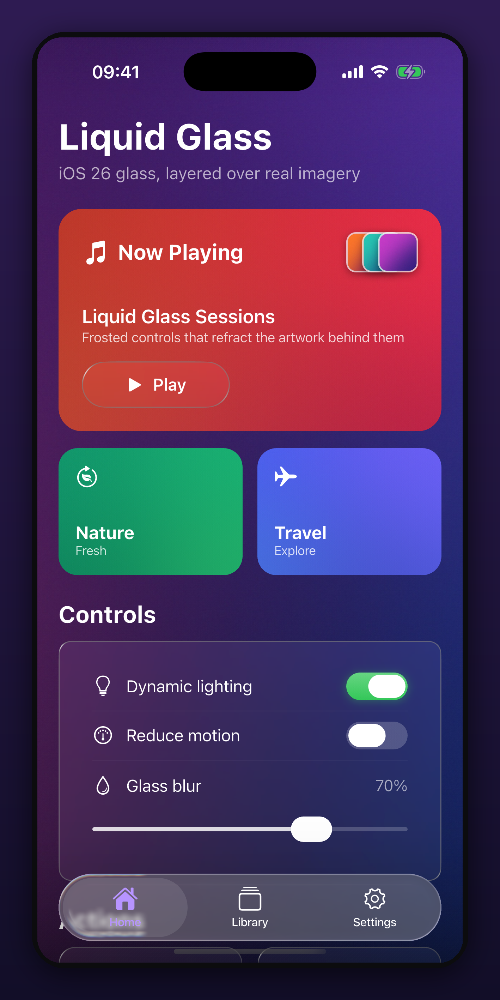
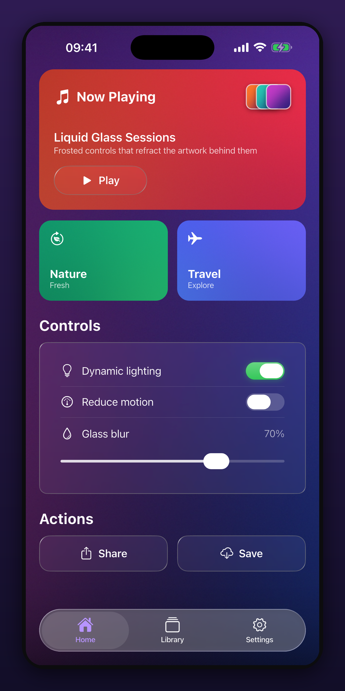
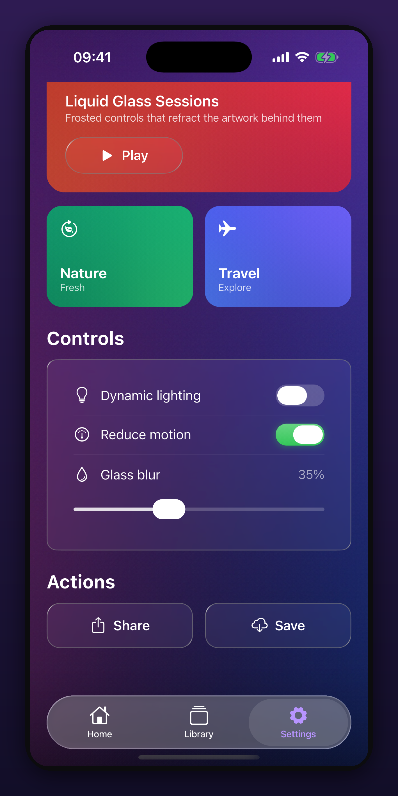
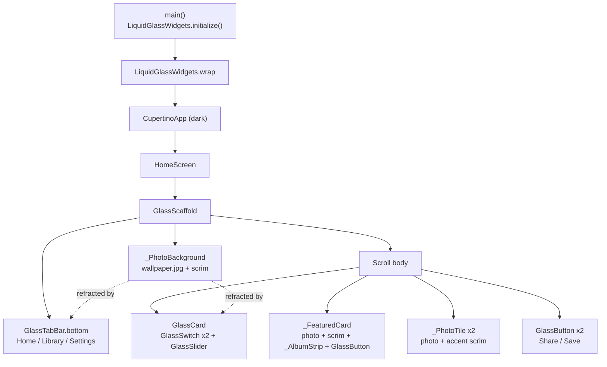

# Liquid Glass Showcase

A polished Flutter demo of Apple's **iOS 26 Liquid Glass** design language - frosted, shader-blurred glass widgets layered over real imagery so the surfaces refract the artwork behind them. Built on the [`liquid_glass_widgets`](https://pub.dev/packages/liquid_glass_widgets) package.

## Screenshots

| Home | Controls & actions | Toggled state |
|:---:|:---:|:---:|
|  |  |  |

## What it shows

- A full-bleed **photographic backdrop** so every glass surface has real imagery to refract and blur (the whole point of Liquid Glass - it looks flat over solid colors).
- A **hero "Now Playing" card**: a photo under a brand-color scrim, an overlapping album-art strip, and a frosted `GlassButton` Play control.
- Two **photo tiles** (Nature, Travel), each layering a photo under an accent scrim.
- An interactive **glass controls card**: two `GlassSwitch` toggles (shown in on/off states) and a `GlassSlider`, all rendered as real glass over the wallpaper.
- A frosted **`GlassTabBar`** bottom bar that picks up and blurs the wallpaper beneath it.

## Architecture



The glass widgets (`GlassScaffold`, `GlassTabBar`, `GlassCard`, `GlassButton`, `GlassSwitch`, `GlassSlider`) come from the package; the composition, the photographic backdrops, and the card layouts are the app. Backdrops are original mesh-gradient renders generated by `tool/gen_assets.py` (no third-party photos).

## Tech stack

- **Flutter** (Cupertino widgets, dark theme)
- **[liquid_glass_widgets](https://pub.dev/packages/liquid_glass_widgets)** `^1.2.1` - iOS 26 Liquid Glass shaders
- **Python + Pillow** - generates the original gradient wallpapers in `assets/photos/`

## Run

```bash
flutter pub get
flutter run          # iOS simulator / device (Impeller recommended)
```

Regenerate the backdrop art:

```bash
python3 tool/gen_assets.py
```

## Credits

Liquid Glass rendering by the MIT-licensed [`liquid_glass_widgets`](https://github.com/sdegenaar/liquid_glass_widgets) package by sdegenaar. This repository is an independent demo app built on top of it.
